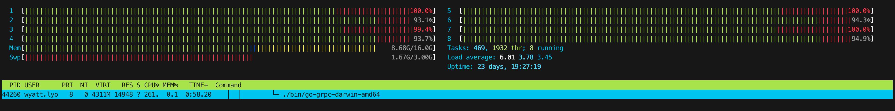
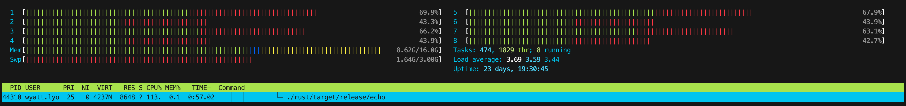
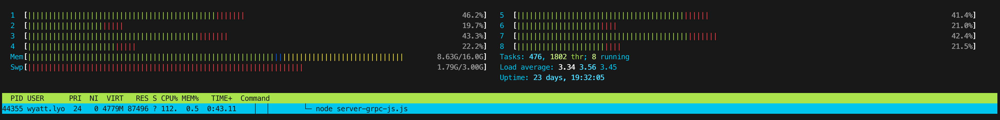

## Instructions

For generating load, [`ghz`](https://github.com/bojand/ghz) is used. For the purposes of this README, it is assumed that `ghz` is installed in the `$PATH`.

Start a server on port 3000:

```
$ node server-grpc-js.js
... or
$ node server-grpc.js
... or
$ ./bin/go-grpc-{arch}
```

Gather all the datas:

```
$ ghz -proto ./echo.proto -insecure -z 40s -c 100 -call EchoService/Echo -d '{}' localhost:3000
```

To test that the service is working run the following:

```
$ grpcurl --plaintext --proto echo.proto localhost:3000 EchoService/Echo
```

## Results

These are the results on macOS Mojave running on a late 2016 MBP with:
- 2.7 GHz Intel Core i7
- 16 GB 2133 MHz LPDDR3

### CPU Usage

Using the [`sampleproc`](https://github.com/opendtrace/toolkit/blob/master/Proc/sampleproc) dtrace script the % of utilization of each process across all CPUs was determined, below are the results. Additionally, running the `topsysproc` script provided information about the number of syscalls for each during a 1 second period, which is also shown below.

| Process | % CPU Usage | # of Samples | Avg Syscall Count |
|---------|-------------|--------------|-------------------|
| node    | 14          | 4596         | 2500              |
| rust    | 14          | 4511         | 80000             |
| go      | 30          | 10079        | 120000            |

Below are htop results for each of the processe. As you can see, memory usage remained low for each process as well, with Node.js using the most.

#### Go htop



#### Rust htop




#### Node.js htop



### Node.js server-grpc-js

```
Summary:
  Count:	427266
  Total:	40006.10 ms
  Slowest:	52.00 ms
  Fastest:	0.96 ms
  Average:	9.32 ms
  Requests/sec:	10680.02

Response time histogram:
  0.962 [1]	|
  6.066 [23826]	|∎∎∎
  11.170 [325308]	|∎∎∎∎∎∎∎∎∎∎∎∎∎∎∎∎∎∎∎∎∎∎∎∎∎∎∎∎∎∎∎∎∎∎∎∎∎∎∎∎
  16.273 [66550]	|∎∎∎∎∎∎∎∎
  21.377 [9938]	|∎
  26.480 [1226]	|
  31.584 [242]	|
  36.688 [11]	|
  41.791 [64]	|
  46.895 [0]	|
  51.999 [100]	|

Latency distribution:
  10% in 6.79 ms
  25% in 7.66 ms
  50% in 8.77 ms
  75% in 10.39 ms
  90% in 12.58 ms
  95% in 14.73 ms
  99% in 18.28 ms
Status code distribution:
  [OK]	427266 responses
```

### Node.js server-grpc

```
Summary:
  Count:	471199
  Total:	40004.82 ms
  Slowest:	7419.06 ms
  Fastest:	1.84 ms
  Average:	8.45 ms
  Requests/sec:	11778.55

Response time histogram:
  1.841 [1]	|
  743.563 [471098]	|∎∎∎∎∎∎∎∎∎∎∎∎∎∎∎∎∎∎∎∎∎∎∎∎∎∎∎∎∎∎∎∎∎∎∎∎∎∎∎∎
  1485.284 [0]	|
  2227.006 [0]	|
  2968.727 [0]	|
  3710.448 [0]	|
  4452.170 [0]	|
  5193.891 [0]	|
  5935.613 [0]	|
  6677.334 [0]	|
  7419.055 [100]	|

Latency distribution:
  10% in 5.13 ms
  25% in 5.78 ms
  50% in 6.43 ms
  75% in 7.16 ms
  90% in 8.46 ms
  95% in 9.62 ms
  99% in 12.50 ms
Status code distribution:
  [OK]	471199 responses
```

### Go

Running with GOMAXPROCS=1

```
Summary:
  Count:	1742699
  Total:	40001.02 ms
  Slowest:	70.97 ms
  Fastest:	0.19 ms
  Average:	2.26 ms
  Requests/sec:	43566.37

Response time histogram:
  0.188 [1]	|
  7.267 [998072]	|∎∎∎∎∎∎∎∎∎∎∎∎∎∎∎∎∎∎∎∎∎∎∎∎∎∎∎∎∎∎∎∎∎∎∎∎∎∎∎∎
  14.345 [1313]	|
  21.423 [208]	|
  28.501 [107]	|
  35.579 [104]	|
  42.658 [54]	|
  49.736 [62]	|
  56.814 [43]	|
  63.892 [30]	|
  70.970 [6]	|

Latency distribution:
  10% in 1.58 ms
  25% in 1.91 ms
  50% in 2.17 ms
  75% in 2.47 ms
  90% in 2.99 ms
  95% in 3.37 ms
  99% in 4.78 ms
Status code distribution:
  [OK]	1742699 responses
```

### Rust

Compiled in release mode

```
Summary:
  Count:	806332
  Total:	40008.54 ms
  Slowest:	39.00 ms
  Fastest:	1.06 ms
  Average:	4.93 ms
  Requests/sec:	20153.99

Response time histogram:
  1.059 [1]	|
  4.853 [543524]	|∎∎∎∎∎∎∎∎∎∎∎∎∎∎∎∎∎∎∎∎∎∎∎∎∎∎∎∎∎∎∎∎∎∎∎∎∎∎∎∎
  8.647 [259033]	|∎∎∎∎∎∎∎∎∎∎∎∎∎∎∎∎∎∎∎
  12.441 [3479]	|
  16.235 [44]	|
  20.029 [90]	|
  23.823 [48]	|
  27.617 [85]	|
  31.411 [0]	|
  35.205 [4]	|
  38.999 [24]	|

Latency distribution:
  10% in 4.23 ms
  25% in 4.39 ms
  50% in 4.60 ms
  75% in 5.14 ms
  90% in 6.29 ms
  95% in 6.50 ms
  99% in 7.45 ms
Status code distribution:
  [OK]	806332 responses
```
